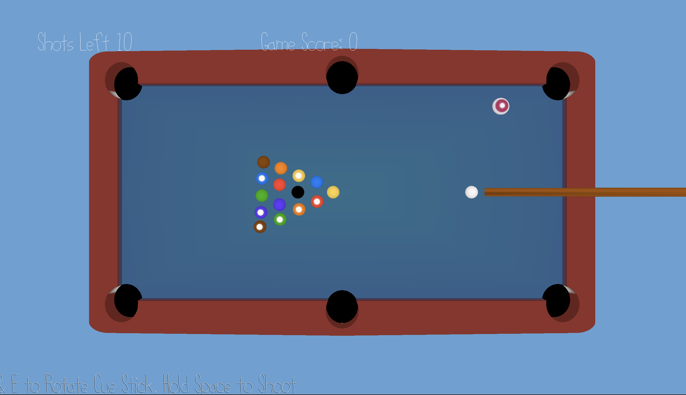

# Crazy 8-Ball 

Author: Jose Lima

Design: This is an arcade version of the classic 8-Ball Pool game. You have 10 shots in total to get as much points as possible, every ball give you a certain number of points.

Screen Shot:

How To Play:

* Press Q and E to rotate cue stick. 

* Press Space to charge power and shoot. 

* Avoid getting the cue and eight ball into a hole to avoid ending the game early. 

* The big pink ball does not lose velocity and is worth the most points!

## Extra Credit

Are your Physics Deterministic? If so, how can we verify this?

Are your Physics Rewindable? If so, how can we verify this?

This game was built with [NEST](NEST.md).
